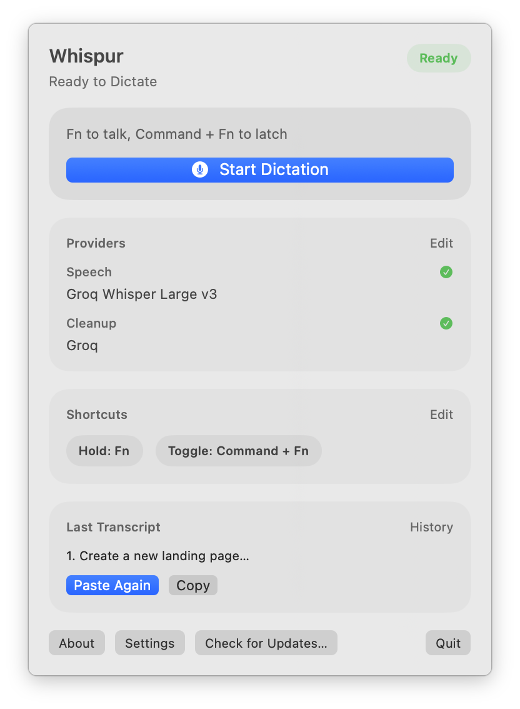
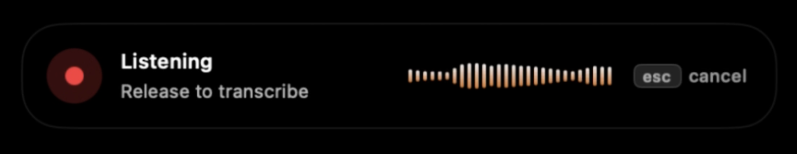
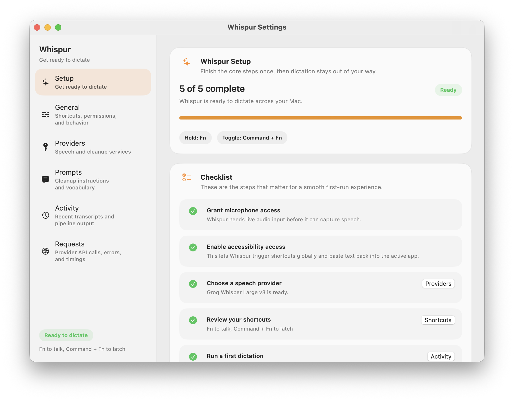
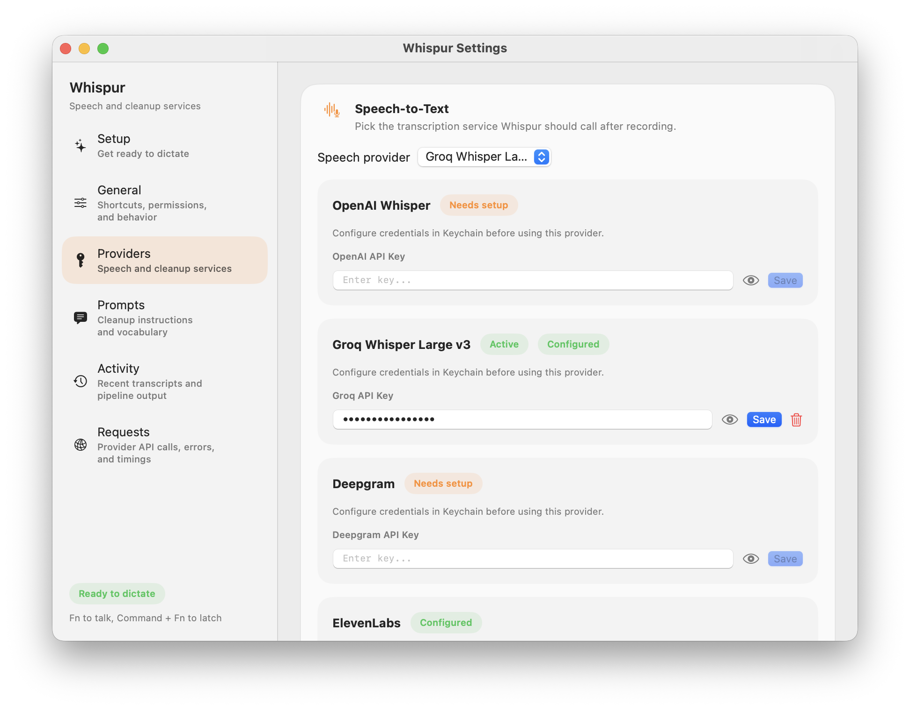

# Whispur

Whispur is a macOS menu-bar dictation app that turns speech into polished text and drops it straight back into the app you are already using.

Hold a shortcut to talk, or use an optional toggle shortcut for hands-free capture. Whispur records, transcribes, optionally cleans up the transcript with an LLM, and pastes the result where your cursor is.


> [whispur.app](https://whispur.app) · [Download DMG](https://github.com/sophiie-ai/whispur/releases/latest/download/Whispur.dmg) · [Changelog](https://whispur.app/changelog)

## Screenshots

| Menu bar | Recording overlay |
|---|---|
|  |  |

| Setup checklist | Provider settings |
|---|---|
|  |  |

## Features

- Lives in the macOS menu bar instead of taking over your desktop
- Hold-to-talk or toggle-to-latch recording
- Multi-provider speech-to-text with local Apple dictation support
- Optional transcript cleanup with provider-selectable LLMs
- Paste-back into the active app with clipboard preservation
- Custom vocabulary and a single editable cleanup prompt for technical dictation
- Local-first default path when you stick with Apple on-device transcription
- Sparkle-based auto-updates for signed releases

## Install

### DMG download

Download the latest signed DMG from [GitHub Releases](https://github.com/sophiie-ai/whispur/releases).

### Homebrew cask

Homebrew installation is planned but not published yet.

### Build from source

```bash
git clone https://github.com/sophiie-ai/whispur.git
cd whispur
brew install xcodegen create-dmg
make all
make run
```

## Setup

1. Launch Whispur from Applications. It opens as a menu-bar app.
2. Open `Settings` from the menu bar.
3. Complete the setup checklist for microphone and Accessibility access.
4. Choose your speech provider.
5. Add API keys for any cloud providers you want to use.
6. Optionally add an LLM provider for transcript cleanup.
7. Review your hold and toggle shortcuts.
8. Dictate into any focused text field.

## Usage

- Hold shortcut: Press and hold your configured shortcut to record, then release to transcribe and paste.
- Toggle shortcut: Press once to start recording, press again to stop and process.
- Activity log: Open `Settings` → `Activity` to inspect raw and cleaned transcripts.
- Prompt tuning: Open `Settings` → `Prompts` to override the cleanup prompt or add domain vocabulary.

## Provider Matrix

### Speech-to-text

| Provider | Status | Notes |
| --- | --- | --- |
| Apple Speech Recognition | Available | On-device and local |
| OpenAI Whisper | Available | Cloud STT via API key |
| Deepgram | Available | Cloud STT via API key |
| ElevenLabs Scribe | Available | Cloud STT via API key |

### Transcript cleanup

| Provider | Status | Notes |
| --- | --- | --- |
| Anthropic Claude | Available | High-quality cleanup |
| OpenAI | Available | Fast cleanup path |
| Groq | Available | OpenAI-compatible endpoint |
| AWS Bedrock | Available | Claude via Bedrock, authenticated with a Bedrock API key (`AWS_BEARER_TOKEN_BEDROCK`) |

## Privacy

Audio stays local by default when you use the built-in Apple speech provider. If you switch to a cloud STT or LLM provider, the audio or transcript needed for that provider is sent only to the services you configure.

Whispur stores API keys in the macOS Keychain.

## Development

```bash
make generate
make all
make dmg
```

Key project areas:

- `Sources/App`: app lifecycle, menu-bar scenes, state
- `Sources/Audio`: recording and normalization
- `Sources/Providers`: STT and LLM integrations
- `Sources/Pipeline`: dictation orchestration
- `Sources/Input`: shortcuts and paste-back
- `Sources/UI`: menu bar, onboarding, settings, about window

## Contributing

See [CONTRIBUTING.md](CONTRIBUTING.md).

## License

Whispur is released under the [MIT License](LICENSE).
