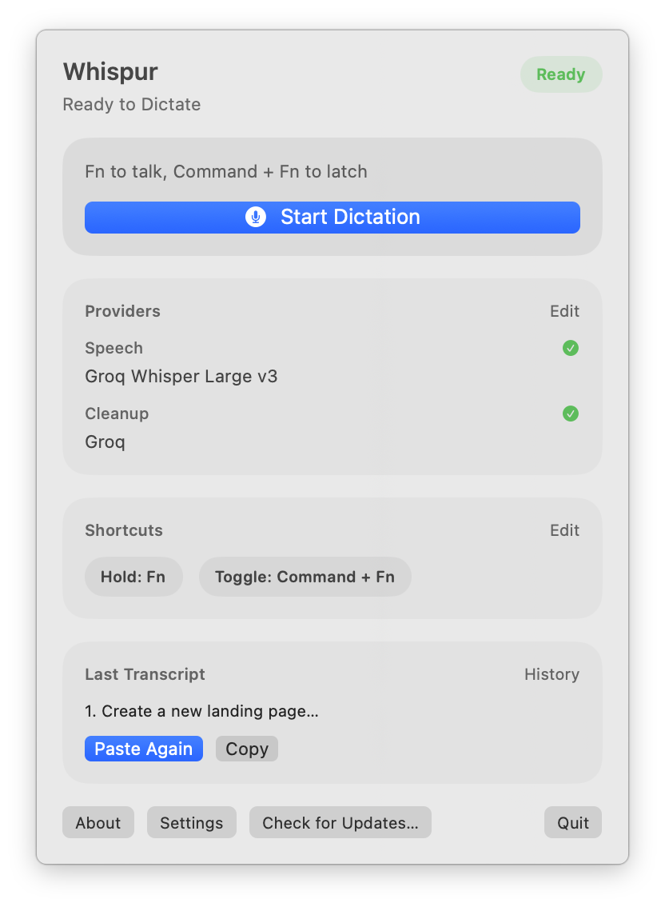
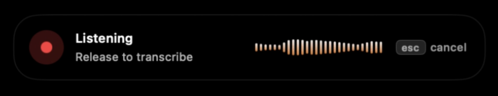
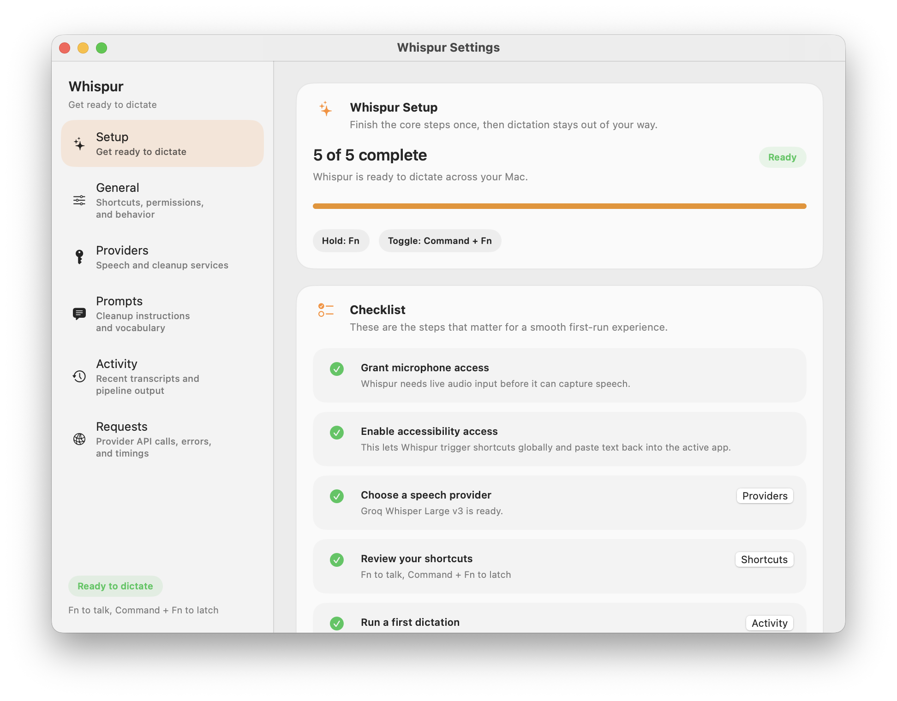
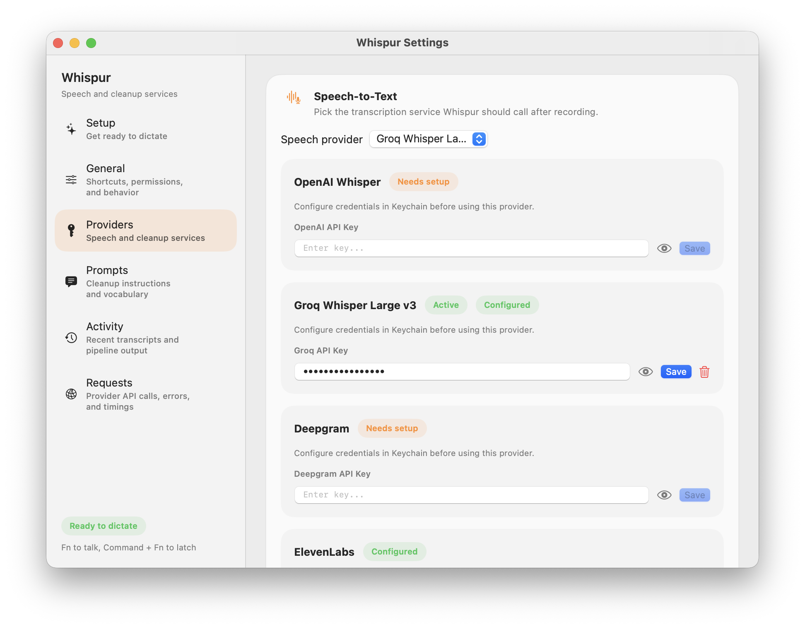

# Whispur

Whispur is a macOS menu-bar dictation app that turns speech into polished text and drops it straight back into the app you are already using.

Hold a shortcut to talk, or use an optional toggle shortcut for hands-free capture. Whispur records, transcribes, optionally cleans up the transcript with an LLM, and pastes the result where your cursor is.


> [whispur.app](https://whispur.app) · [Download DMG](https://github.com/sophiie-ai/whispur/releases/latest/download/Whispur.dmg) · [Changelog](https://whispur.app/changelog)

## Screenshots

| Menu bar | Recording overlay |
|---|---|
|  |  |

| Setup checklist | Provider settings |
|---|---|
|  |  |

## Features

- Lives in the macOS menu bar instead of taking over your desktop
- Hold-to-talk or toggle-to-latch recording
- Multi-provider speech-to-text with on-device Apple and NVIDIA Parakeet options
- Optional transcript cleanup with provider-selectable LLMs; switch off `Clean up with AI` (`Settings` → `Providers`, or the cleanup chip in the menu bar) to paste exactly what the speech engine heard, with no LLM request
- Paste-back into the active app with clipboard preservation
- Custom vocabulary and a single editable cleanup prompt for technical dictation
- Local-first by default: with no cloud speech key, Whispur uses NVIDIA Parakeet on Apple silicon (Apple on-device on Intel Macs), and Apple on-device transcribes while Parakeet's model downloads in the background
- Sparkle-based auto-updates for signed releases

## Install

### DMG download

Download the latest signed DMG from [GitHub Releases](https://github.com/sophiie-ai/whispur/releases).

### Homebrew cask

Homebrew installation is planned but not published yet.

### Build from source

```bash
git clone https://github.com/sophiie-ai/whispur.git
cd whispur
brew install xcodegen create-dmg
make all
make run
```

## Setup

1. Launch Whispur from Applications. It opens as a menu-bar app.
2. Open `Settings` from the menu bar.
3. Complete the setup checklist for microphone and Accessibility access.
4. Choose your speech provider.
5. Add API keys for any cloud providers you want to use.
6. Optionally add an LLM provider for transcript cleanup.
7. Review your hold and toggle shortcuts.
8. Dictate into any focused text field.

## Usage

- Hold shortcut: Press and hold your configured shortcut to record, then release to transcribe and paste.
- Toggle shortcut: By default, press Command + Fn to start hands-free recording and press it again to stop and process. You can also pick Fn twice (press Fn twice to start, once to stop); set "Press 🌐 key to" to Do Nothing in System Settings > Keyboard so macOS doesn't open the Emoji & Symbols panel.
- Live words: With "Stream audio while you talk" on (ElevenLabs Scribe and Meta Muse), the recording overlay shows the words heard so far: the last two lines under the standard overlay, or one line beside the compact pill's waveform.
- Use raw: When cleanup changed your words, a small "Cleaned up · Use raw ⌥⌘Z" toast shows for 4 seconds after the paste. Press ⌥⌘Z (or click it) to swap the pasted text for exactly what you said. It works only in the app you dictated into and only until you type something else; turn it off in `Settings` → `Preferences`.
- Activity log: Open `Settings` → `Activity` to inspect raw and cleaned transcripts. A failed dictation keeps its recording for 24 hours so you can retry it; the retried text is copied to the clipboard.
- Mark as wrong: In `Settings` → `Activity`, expand a dictation and choose `Mark as wrong` (or right-click it). Fix what it should have said, tag it if you like, and Whispur appends one line to `~/Library/Application Support/Whispur/MyEvalCases.jsonl`. The file stays on your Mac; `Reveal file` in Activity opens it in Finder. Each line uses the same fields as `Evals/cleanup/cases.jsonl` with `"split": "mine"`, so you can score the cleanup prompt against your own dictations with the eval runner's `--cases-file` flag:

  ```bash
  python3 scripts/eval-cleanup.py --provider openai --prompt new \
    --cases-file ~/Library/Application\ Support/Whispur/MyEvalCases.jsonl
  ```
- Prompt tuning: Open `Settings` → `Prompts` to override the cleanup prompt or add domain vocabulary.
- Cleanup model: Open `Settings` → `Providers` and set `Custom Model` on any cleanup provider to use a model other than the default.

## Provider Matrix

### Speech-to-text

| Provider | Status | Notes |
| --- | --- | --- |
| Apple Speech Recognition | Available | On-device and local. Uses SpeechAnalyzer on macOS 26 and later. The default on Intel Macs, and the fallback while Parakeet's model downloads |
| Parakeet (on this Mac) | Available | NVIDIA Parakeet (Parakeet Ultra, 25 European languages) on the Neural Engine via [FluidAudio](https://github.com/FluidInference/FluidAudio). No key; a one-time ~630 MB model download to `~/Library/Application Support/Whispur/Models`. Model weights: CC BY 4.0. The default on Apple silicon for anyone who hasn't picked a provider and has no cloud speech key: the model downloads in the background on first launch (it waits out metered and Low Data Mode networks) and Whispur switches to it by itself once it's ready |
| OpenAI | Available | GPT Transcribe (default) or Whisper, via API key |
| Groq Whisper | Available | Whisper Large v3 or v3 Turbo, via API key |
| Deepgram | Available | Cloud STT via API key |
| ElevenLabs Scribe | Available | Cloud STT via API key. Optional live streaming while you talk |
| Mistral Voxtral | Available | Voxtral Mini or Small Transcribe 3, via API key |
| Meta Muse | Available | Muse Voice Transcribe via a Meta Model API key. Optional live streaming while you talk |

### Transcript cleanup

| Provider | Status | Notes |
| --- | --- | --- |
| Anthropic Claude | Available | High-quality cleanup |
| OpenAI | Available | Fast cleanup path |
| Groq | Available | OpenAI-compatible endpoint |
| AWS Bedrock | Available | Claude via Bedrock, authenticated with a Bedrock API key (`AWS_BEARER_TOKEN_BEDROCK`) |

## Privacy

Audio stays local by default when you use the built-in Apple speech provider, and with Parakeet, which runs on this Mac once its model is downloaded. If you switch to a cloud STT or LLM provider, the audio or transcript needed for that provider is sent only to the services you configure.

Whispur stores API keys in the macOS Keychain.

## Development

```bash
make generate
make all
make dmg
```

Key project areas:

- `Sources/App`: app lifecycle, menu-bar scenes, state
- `Sources/Audio`: recording and normalization
- `Sources/Providers`: STT and LLM integrations
- `Sources/Pipeline`: dictation orchestration
- `Sources/Input`: shortcuts and paste-back
- `Sources/UI`: menu bar, onboarding, settings, about window

## Contributing

See [CONTRIBUTING.md](CONTRIBUTING.md).

## License

Whispur is released under the [MIT License](LICENSE).
